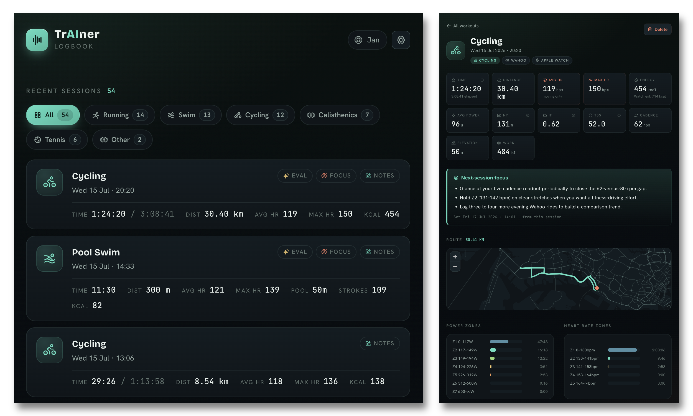

# TrAIner

Personal training analysis platform. Raw workout exports from fitness devices flow through a Cloudflare-based ingest/MCP pipeline. Workouts get analyzed two ways — quick in-app AI evaluations (Cloudflare Workers AI) for a fast per-session read, and frontier models (Claude/ChatGPT) via MCP for deeper, back-and-forth analysis of a specific workout or sport. Multi-user — each athlete signs in, sets up their own profile and data feed, and only ever sees their own workouts.



See [AGENTS.md](AGENTS.md) for how an AI agent should work in this repo (fetching an athlete's context via MCP, the analysis playbook, instrumentation quirks) — this README is for humans: what the repo is and how to set it up. (`CLAUDE.md` is a one-line shim that imports `AGENTS.md`, since Claude Code discovers `CLAUDE.md` rather than `AGENTS.md`.)

## Repo layout

```
.
├── AGENTS.md          ← AI agent guide to this repo (MCP usage, analysis playbook)
├── CLAUDE.md          ← one-line shim importing AGENTS.md (Claude Code reads CLAUDE.md)
├── app/               ← Cloudflare Worker: ingest webhook + UI (workouts, notes, profile, focus)
└── mcp/               ← Cloudflare Worker: MCP server exposing workout data to AI assistants
```

All workout data — raw exports, derived metrics, notes, athlete profile, equipment tags, focus/eval history — lives in the Cloudflare pipeline (R2 + D1), not in this repo. Each athlete fills in their own profile (age, VO2max, HR zones, active sports, equipment) on the Settings page after signing in — see [Working in this repo](#working-in-this-repo).

## Pipeline

```
Apple Watch → Health Auto Export / Wahoo Cloud API → Worker /ingest → R2 (raw) + D1 (structured) → MCP server → AI assistant
```

- **`app/`** — ingest webhook (`/ingest`), Wahoo OAuth + FIT webhook, and a browser UI for reviewing workouts, editing notes, and tagging equipment. The workout detail page also has a **"Generate evaluation"** button that runs an on-demand AI assessment (Cloudflare Workers AI) comparing the session against a cohort of the athlete's own comparable past workouts, and auto-writes both the evaluation and an evolved next-session focus — the same `session_evals` / `session_focus` surfaces an AI assistant writes via MCP. Full design in [app/ARCHITECTURE.md](app/ARCHITECTURE.md).
- **`mcp/`** — the MCP server an AI assistant connects to (configured in `.mcp.json` as `training`) for semantic queries over workout data (recent workouts, personal bests, stroke drift, session focus, etc.) without exposing raw SQL.

Both are separate Cloudflare Workers with their own `wrangler.jsonc`, `package.json`, and deploy lifecycle (`npm run dev` / `npm run deploy` in each).

## Working in this repo

- **First time signing in**: fill in your profile on the Settings page (age, VO2max/HR zones, active sports, equipment) — the connected AI reads this via MCP at the start of an analysis instead of relying on hardcoded assumptions.
- Analyzing workouts: use the `training` MCP tools (`get_athlete_profile`, `get_recent_workouts`, `get_workout_detail`, `stroke_count_drift`, `get_current_focus`/`set_next_focus`, etc.) rather than querying D1 directly — see the [analysis playbook](AGENTS.md#analysis-playbook).
- **In-app evaluations**: on a workout's detail page, "Generate evaluation" produces an assessment and next-session focus without opening a chat, using Workers AI (GLM 5.2). Regenerating refreshes both. Each eval records which model authored it, so the byline reads "GLM 5.2" (in-app button) or the name of the AI assistant that wrote it via MCP. This shares the eval/focus tables with the MCP path — a fresh in-app or chat run just overwrites the previous one.
- Changing the pipeline: read [app/ARCHITECTURE.md](app/ARCHITECTURE.md) first — it documents the schema, auth model, dedup/supersession logic, and open TODOs in detail.

## Setup (deploying your own instance)

This deploys two Cloudflare Workers (`app/`, `mcp/`) sharing one D1 database, gated by Cloudflare Access. Expect 30–45 minutes for a first-time setup.

### Prerequisites

- A Cloudflare account with a domain on it (for custom domains — Workers routes need a real zone, `*.workers.dev` is deliberately disabled here).
- Cloudflare **Zero Trust** enabled on that account (free tier is fine) — this is what Access authenticates against.
- Node.js 18+, and `npx` (wrangler is a devDependency in both `app/` and `mcp/`, no global install needed).
- [Health Auto Export](https://apps.apple.com/sg/app/health-auto-export-json-csv/id1115567069) (iOS, **Premium**) if ingesting from an Apple Watch — the REST-API automation that POSTs to `/ingest` is Premium-only.
- Optional: a [Wahoo Cloud API](https://developers.wahooligan.com/) developer app, only if ingesting cycling data from a Wahoo head unit.

### 1. Clone and install

```sh
git clone <this-repo>
cd training/app && npm install && cp wrangler.jsonc.example wrangler.jsonc
cd ../mcp && npm install && cp wrangler.jsonc.example wrangler.jsonc
cd .. && cp .mcp.json.example .mcp.json
```

`wrangler.jsonc` (both workers) and `.mcp.json` are gitignored — they hold real hostnames, account/database/KV ids, none of which should end up in git history. The `.example` files are the committed templates; steps 2–4 below tell you what to fill in.

### 2. Pick your hostnames

You need **three** subdomains on one Cloudflare zone — pick your own names, e.g. under `yourdomain.com`:

| Hostname | Worker | Purpose |
|---|---|---|
| `training.yourdomain.com` | `app` | Browser UI, behind Access |
| `training-ingest.yourdomain.com` | `app` | Webhook (HAE + Wahoo), NOT behind Access |
| `training-mcp.yourdomain.com` | `mcp` | MCP server, Access-gated via OAuth |

No DNS records need creating manually — Workers custom domains auto-provision DNS + a cert on first deploy, as long as the zone is on your Cloudflare account.

### 3. Cloudflare resources

From the Cloudflare dashboard (or `wrangler` CLI), create:

```sh
# D1 — shared by both workers
npx wrangler d1 create training
# → copy the returned database_id into BOTH app/wrangler.jsonc and mcp/wrangler.jsonc

# R2 — raw payload archive (app/ only)
npx wrangler r2 bucket create training-raw

# KV — app/ (Wahoo OAuth state, reused as a scratch namespace)
npx wrangler kv namespace create LAST_PAYLOAD

# KV — mcp/ (OAuth grants/session state)
npx wrangler kv namespace create OAUTH_KV
```

Paste the returned account id, `database_id`, and KV `id`s into `app/wrangler.jsonc` and `mcp/wrangler.jsonc` (they already have placeholders showing where each goes — the `account_id`, D1 `database_id`, and KV `id`s are not secrets, just deployment-specific identifiers).

Workers AI (the `ai` binding in `app/wrangler.jsonc`, powering "Generate evaluation") needs **no resource to create** — it's on by default for every account. Note it's billed per inference call, unlike the free/cheap tiers the rest of the pipeline sits on, and has no local emulation (`wrangler dev` proxies it to the real API — see the binding's comment in `app/wrangler.jsonc` for how to exercise it locally).

### 4. Cloudflare Access — two separate applications

Zero Trust dashboard → **Access → Applications**. You need two apps, of two different types:

**a. Self-hosted app, for the UI (`app/`)**
- Application domain: `training.yourdomain.com` (the UI host only — never gate the ingest host, HAE/Wahoo can't do interactive SSO).
- Policy: allow the athlete(s) who should have access (by email, or your IdP's group).
- Copy the **Application Audience (AUD) tag** and your team domain (`https://<team>.cloudflareaccess.com`) into `app/wrangler.jsonc`'s `vars.ACCESS_AUD` / `vars.ACCESS_TEAM_DOMAIN`.

**b. SaaS application (OIDC), for the MCP server (`mcp/`)**
- This is the "Access as an OIDC identity provider" pattern (`workers-oauth-provider`'s Access-for-SaaS flow — see `mcp/src/access-handler.ts`).
- Add application → **SaaS** → **OIDC**. Redirect URL: `https://training-mcp.yourdomain.com/callback`.
- Same access policy as above (same athletes should be able to use both).
- Cloudflare shows you a **Client ID**, **Client Secret**, and the three OIDC endpoint URLs (authorization/token/JWKS — they embed the client ID). Copy the client ID + all three URLs into `mcp/wrangler.jsonc`'s `vars` (`ACCESS_CLIENT_ID`, `ACCESS_AUTHORIZATION_URL`, `ACCESS_TOKEN_URL`, `ACCESS_JWKS_URL`) — these are not secrets. Keep the **client secret** for the next step.

### 5. Secrets

Never put these in `wrangler.jsonc` — set them per-worker:

```sh
cd mcp
npx wrangler secret put ACCESS_CLIENT_SECRET       # from step 4b
npx wrangler secret put COOKIE_ENCRYPTION_KEY       # any random string, e.g. `openssl rand -hex 32`
```

```sh
cd app
# Only needed if ingesting Wahoo cycling data — skip otherwise:
npx wrangler secret put WAHOO_WEBHOOK_TOKEN
npx wrangler secret put WAHOO_CLIENT_ID
npx wrangler secret put WAHOO_CLIENT_SECRET
```

For local dev, mirror the same names in a gitignored `app/.dev.vars` (see the comments in `app/wrangler.jsonc` / `app/src/index.ts` for the full list, including `DEV_USER_EMAIL` — a local-only Access bypass, **never** set it as a real secret).

### 6. Apply migrations and deploy

```sh
cd app
npx wrangler d1 migrations apply training           # --local instead, for local dev
npx wrangler deploy

cd ../mcp
npx wrangler deploy
```

### 7. First sign-in and ingest token

1. Visit `https://training.yourdomain.com` — Access will prompt you to sign in (your identity provider, e.g. Google/GitHub/email OTP). Signing in auto-provisions your `users` row.
2. Go to **Settings**, generate an ingest token (`htk_...`) — shown once.
3. In [Health Auto Export](https://apps.apple.com/sg/app/health-auto-export-json-csv/id1115567069): add a REST API automation → URL `https://training-ingest.yourdomain.com/ingest` → header `Authorization: Bearer <token>` → JSON export at **per-second** granularity (per-minute is too coarse for lap reconstruction).

### 8. Connect an AI assistant to the MCP server

Add `training-mcp.yourdomain.com/mcp` as a remote MCP connector in any MCP-capable client — the Settings page (step 7) shows the exact URL and transport (Streamable HTTP). Where to add it depends on the client, e.g.:
- **Claude Code** (or another CLI agent with a `.mcp.json`): update the `url` in your local `.mcp.json` (created from the example in step 1) to your own hostname.
- **claude.ai / Claude Desktop / ChatGPT**: add it as a custom connector in settings, using the same URL. The first connection triggers the Access OAuth flow from step 4b.

### 9. Optional: Wahoo cycling

Only needed if a Wahoo head unit is in the picture (see [app/ARCHITECTURE.md](app/ARCHITECTURE.md#wahoo-cloud-api-cycling) for the full flow). Register a Wahoo developer app with:
- Redirect URI — `https://training-ingest.yourdomain.com/wahoo/oauth/callback`
- Webhook URI — `https://training-ingest.yourdomain.com/wahoo/webhook`
- Scopes — at minimum `email`, `user_read`, `workouts_read`, `offline_data`.

Then set the three `WAHOO_*` secrets from step 5, and visit `/api/wahoo/authorize` (signed in via Access) once to link your account.

### Adding a second athlete

Multi-user is built in — no separate signup flow. A second person just signs in through the same Access application (add them to the Access policy in step 4a/4b first), repeats step 7 for their own ingest token, and fills in their own profile on the Settings page. Each athlete's profile, workouts, notes, and focus are fully isolated — nobody sees anyone else's data.

## Cloud development (Claude Code on the web)

Cloud sessions clone this repo fresh from its git remote — the gitignored files from steps 1–4 above (`app/wrangler.jsonc`, `mcp/wrangler.jsonc`, `.mcp.json`) won't be there. To let a cloud session run `wrangler deploy`, reconstruct them from the cloud environment's own config instead of committing them:

1. **Environment variables** (in the environment's settings, once per environment — persists across sessions using it):
   - `CLOUDFLARE_API_TOKEN` — a **scoped** token (Cloudflare dashboard → My Profile → API Tokens → "Edit Cloudflare Workers" template), not your global API key. `wrangler deploy` picks this up automatically for non-interactive auth — there's no browser OAuth flow in a cloud sandbox.
   - `APP_WRANGLER_JSONC_B64` / `MCP_WRANGLER_JSONC_B64` — `base64 < app/wrangler.jsonc` / `base64 < mcp/wrangler.jsonc` output from your real, filled-in local copies. Simplest way to hand over the real config without committing it or re-deriving it from a dozen smaller variables.

2. **Setup script** (runs once at environment creation, cached after that):
   ```sh
   [ -n "$APP_WRANGLER_JSONC_B64" ] && echo "$APP_WRANGLER_JSONC_B64" | base64 -d > app/wrangler.jsonc
   [ -n "$MCP_WRANGLER_JSONC_B64" ] && echo "$MCP_WRANGLER_JSONC_B64" | base64 -d > mcp/wrangler.jsonc
   (cd app && npm install) && (cd mcp && npm install)
   ```

From there, a cloud session can `npx wrangler deploy` in either directory same as local.

**Caveat, read before doing this:** as of writing, Claude Code's cloud environments don't have a dedicated secrets vault — environment variables and setup scripts are visible to anyone who can edit that environment's config. For a single-user personal project that's a reasonable tradeoff (versus the alternative of committing real hostnames to git), but it means the Cloudflare API token and the real hostnames live in one more place. Use a token scoped to Workers-deploy-only, not full account access, to limit the blast radius if that config is ever exposed.
